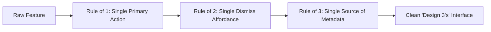

# The Universal "Design 3's" Framework
**A Project-Agnostic Specification for Product Design, UX Architecture, and Interface Engineering**

> **Version:** 2.0.0 (Universal Edition)  
> **Applicability:** Mobile Apps (iOS / Android), Web Applications, Enterprise SaaS, Desktop UI, IoT & Field Systems.  
> **Foundational Axiom:** *"Simplicity is not the lack of clutter; that's just a consequence of simplicity. Simplicity somehow essentially describes the purpose and place of an object."* — Dieter Rams

---

## 1. Executive Summary & Cognitive Foundations

The **"Design 3's"** framework is a universal UX and interface engineering system designed to eliminate cognitive overload, reduce operational error rates, and deliver high-velocity user interfaces.

Human working memory operates under strict cognitive bandwidth limits (Cowan's $4 \pm 1$ capacity limit; Miller's Law). When an interface presents more than 3 competing visual levels or requires more than 3 mental leaps, user error rates spike and task completion times degrade exponentially (Hick's Law).

The framework standardizes every interface across **3 Universal Dimensions**:
1. **The 3 Foundational Pillars** (Structure, Elimination, Psychology)
2. **The 3-Phase Interaction Law** (Discover $\rightarrow$ Focus $\rightarrow$ Commit)
3. **The 3-Tier Design Token System** (Global $\rightarrow$ Semantic $\rightarrow$ Component)

```
                              ┌───────────────────────────────────┐
                              │     THE GLOBAL "DESIGN 3's"       │
                              └─────────────────┬─────────────────┘
                                                │
         ┌──────────────────────────────────────┼──────────────────────────────────────┐
         │                                      │                                      │
         ▼                                      ▼                                      ▼
  ┌──────────────┐                       ┌──────────────┐                       ┌──────────────┐
  │ DIMENSION 1  │                       │ DIMENSION 2  │                       │ DIMENSION 3  │
  │ The 3 Pillars│                       │ The 3 Phases │                       │ The 3 Tokens │
  └──────┬───────┘                       └──────┬───────┘                       └──────┬───────┘
         │                                      │                                      │
  1. Structure                           1. Discovery                           1. Primitives
  2. Elimination                         2. Focus                               2. Semantics
  3. Psychology                          3. Commitment                          3. Components
```

---

## 2. Dimension 1: The 3 Foundational Pillars

### 🏛️ Pillar 1: Structural Hierarchy (The Law of Three Tiers)

Every screen, view, or viewport must have **exactly three hierarchical layers**—never more, never fewer:

```
┌─────────────────────────────────────────────────────────────┐
│ 1. PRIMARY FOCAL TIER (70% Visual Weight)                    │
│    • The single critical action, key metric, or hero object │
│    • E.g., The Unified Action Card, Main Chart, or Form     │
├─────────────────────────────────────────────────────────────┤
│ 2. SECONDARY CONTEXT TIER (20% Visual Weight)               │
│    • Explanatory copy, filter chips, breadcrumbs, sub-tags  │
├─────────────────────────────────────────────────────────────┤
│ 3. TERTIARY ANCHOR TIER (10% Visual Weight)                 │
│    • Timestamps, auxiliary IDs, subtle metadata, version    │
└─────────────────────────────────────────────────────────────┘
```

#### Core Rules:
1. **The Unified Hero Principle**: Consolidate fragmented visual containers into a single hero element. Never scatter related data across 4 or 5 floating cards.
2. **Progressive Disclosure**: Surface advanced options only when relevant. Use sliding sheets, drawers, or accordion steps instead of overwhelming full-page forms.
3. **Single-Axis Navigation**: Align user flow along a single visual vector (top-to-bottom on mobile, left-to-right on desktop).

---

### 📐 Pillar 2: Elimination & Constraint (The Law of Zero Redundancy)

*“Less, but better.”* What you remove is more important than what you add.



#### Core Rules:
1. **Single Source of Truth for Metadata**: Display an attribute (e.g. status, location, timestamp) **exactly once** on screen with high typographic clarity. Never duplicate it in badges, card bodies, and footers simultaneously.
2. **Single Dismiss Affordance**: Modals and sheets must have **one** clear dismiss mechanism.
   * *If a modal has an `✕` close button, omit the top grab handle pill (`---`).*
   * *If a bottom sheet relies on swipe-to-dismiss, use a prominent handle and omit floating corner buttons.*
   * *Having both creates double vertical spacing and layout collision.*
3. **High-Contrast State Integrity**: Never degrade active states with washed-out styling.
   * **Rule**: When a button is in a `loading` state, maintain its solid background color and render a 100% opaque, crisp spinner/text.
   * **Anti-Pattern**: Setting `opacity: 0.5` on the entire button container during network requests, which washes out brand colors into pale translucent pastels.

---

### 🧠 Pillar 3: Human Psychology & Ergonomics (The 3 Reaction Speeds)

Design for human reaction speeds and motor ergonomics:

```
  0.5s Glance ───► 3.0s Comprehension ───► 30s Execution
  (Perception)          (Evaluation)             (Action)
```

#### Core Rules:
1. **The 0.5-Second Glanceability Rule**:
   * A user under high stress or distraction must understand:
     1. *Where am I?* (Clear contextual headline)
     2. *What is the state?* (High-contrast semantic status)
     3. *What do I do next?* (Unambiguous primary CTA)
2. **Ergonomic Reach (Thumb & Fitts' Law Zone)**:
   * **Mobile**: Place high-frequency destructive or progression actions in the bottom 40% thumb zone. Minimum touch target: `48dp` to `52dp`.
   * **Desktop/Web**: Place primary triggers at the logical conclusion of the reading eye-path (bottom-right for forms, top-right for dashboards).
3. **Asynchronous State Isolation**:
   * Never allow background polling or network state refreshes to reset or jitter in-progress user inputs, camera captures, or form fields.

---

## 3. Dimension 2: The 3-Phase Interaction Law

Every workflow—from login to multi-step enterprise checkout or IoT maintenance—must follow three distinct, self-contained phases:

```
  PHASE 1: DISCOVER ────────► PHASE 2: FOCUS ────────► PHASE 3: COMMIT
  • Inbox / Overview           • Step-by-Step Input     • Side-by-Side Review
  • Instant Priority Alert     • Clean Viewport Area    • Security / Signature
  • Direct [Start] CTA         • Real-Time Progress     • Offline Queue & Sync
```

### Phase 1: Discover & Trigger (Zero Friction)
* Immediate scannability with clear filter tags (`All`, `Active`, `Done`).
* Urgent items surface as a distinct **Priority Alert Banner** at the top of the queue.
* The primary card action directly launches the workflow without intermediate dead-end screens.

### Phase 2: Focus & Guided Input (Progressive Disclosure)
* One step at a time inside a focused surface (Bottom Sheet, Drawer, or Stepper).
* Form fields and checklists are grouped into logical, chunked categories.
* Visual indicators display real-time completion state (e.g. `Progress: 8/10 done`).

### Phase 3: Commit & Verification (Transparent Assurance)
* Summary review (e.g. Side-by-side Before/After comparison, order summary, or diff).
* Identity or authorization verification (Biometric confirmation, 2FA, or signature).
* Immediate tactile feedback with offline resilience (local queueing and auto-sync).

---

## 4. Dimension 3: The 3-Tier Design Token Architecture

To ensure consistency across any tech stack (React, React Native, Vue, Flutter, iOS Swift, Android Kotlin, or Web CSS), structure tokens into 3 distinct tiers:

```
┌─────────────────────────────────────────────────────────────┐
│ TIER 1: PRIMITIVES (Raw Values)                             │
│ • Colors: Red-900, Gray-100, Gold-500                       │
│ • Scale: 4px, 8px, 12px, 16px, 24px, 32px                   │
│ • Type: 12px, 14px, 16px, 18px, 22px, 28px                 │
├─────────────────────────────────────────────────────────────┤
│ TIER 2: SEMANTICS (Intent & Role)                           │
│ • Surface: `background`, `cardSurface`, `overlay`           │
│ • Action: `primary`, `primaryPressed`, `disabled`           │
│ • Feedback: `success`, `warning`, `danger`, `info`          │
│ • Text: `textPrimary`, `textMuted`, `textInverse`           │
├─────────────────────────────────────────────────────────────┤
│ TIER 3: COMPONENTS (Scoped Bindings)                        │
│ • Button: `btnPrimaryBg`, `btnRadius: 14px`, `btnHeight: 52px`│
│ • Modal: `modalHeaderHeight`, `modalBorderRadius: 24px`     │
│ • Card: `cardPadding: 16px`, `cardElevation: 2`             │
└─────────────────────────────────────────────────────────────┘
```

### 4.1 Token Specification Reference (JSON / TypeScript)

```typescript
export const DESIGN_3_TOKENS = {
  // 1. Spacing (4pt Grid System)
  spacing: {
    xs: 4,
    sm: 8,
    md: 12,
    lg: 16,
    xl: 20,
    xxl: 24,
    xxxl: 32,
    huge: 40,
  },

  // 2. Radii
  radii: {
    sm: 6,
    md: 10,
    lg: 14,
    sheet: 24,
    pill: 999,
  },

  // 3. Typography Scale
  typography: {
    display: { size: 28, lineHeight: 34, weight: '800', letterSpacing: -0.5 },
    headline: { size: 22, lineHeight: 28, weight: '700', letterSpacing: -0.3 },
    title: { size: 18, lineHeight: 24, weight: '700', letterSpacing: 0 },
    subTitle: { size: 16, lineHeight: 22, weight: '600', letterSpacing: 0 },
    body: { size: 15, lineHeight: 22, weight: '400', letterSpacing: 0 },
    bodyMuted: { size: 14, lineHeight: 20, weight: '400', letterSpacing: 0 },
    caption: { size: 12, lineHeight: 16, weight: '500', letterSpacing: 0 },
    labelUpper: { size: 11, lineHeight: 14, weight: '700', letterSpacing: 0.8, transform: 'uppercase' },
  },

  // 4. Elevation & Depth
  elevation: {
    card: {
      shadowColor: '#000000',
      shadowOffset: { width: 0, height: 1 },
      shadowOpacity: 0.08,
      shadowRadius: 3,
      elevation: 2,
    },
    modal: {
      shadowColor: '#000000',
      shadowOffset: { width: 0, height: -2 },
      shadowOpacity: 0.15,
      shadowRadius: 8,
      elevation: 5,
    },
  },
} as const;
```

---

## 5. Universal Component Standards & Code Patterns

### 5.1 The Robust Button Pattern (Cross-Platform)

**The Rule**: Static disabled state and active network loading state must be strictly decoupled.

```tsx
// ✅ UNIVERSAL REACT / REACT NATIVE IMPLEMENTATION
interface ButtonProps {
  label: string;
  onPress: () => void;
  loading?: boolean;
  disabled?: boolean;
  variant?: 'primary' | 'secondary' | 'danger';
}

export function ActionButton({
  label,
  onPress,
  loading = false,
  disabled = false,
  variant = 'primary',
}: ButtonProps) {
  // Decouple user interaction blocking from visual opacity dimming
  const isInteractionBlocked = disabled || loading;
  const isVisuallyDisabled = disabled && !loading;

  return (
    <button
      disabled={isInteractionBlocked}
      onClick={onPress}
      className={`
        relative flex items-center justify-center min-h-[52px] px-6 rounded-xl font-bold text-[15px]
        transition-all duration-150 active:scale-[0.98]
        ${variant === 'primary' ? 'bg-primary text-white' : ''}
        ${variant === 'danger' ? 'bg-danger text-white' : ''}
        ${isVisuallyDisabled ? 'opacity-40 cursor-not-allowed' : 'opacity-100'}
      `}
    >
      {loading ? (
        <span className="flex items-center gap-2 text-white opacity-100">
          <Spinner className="w-5 h-5 text-white animate-spin" />
          <span>Processing...</span>
        </span>
      ) : (
        <span>{label}</span>
      )}
    </button>
  );
}
```

---

### 5.2 The Unified Header Pattern (Modal & Sheet Standard)

**The Rule**: Never stack a grab handle above a close button. Maintain a clean single-row layout.

```tsx
// ✅ UNIVERSAL HEADER PATTERN
export function ModalHeader({
  stepText,
  title,
  subTitle,
  onClose,
}: {
  stepText?: string;
  title: string;
  subTitle?: string;
  onClose: () => void;
}) {
  return (
    <div className="flex items-center justify-between pb-3 mb-4 border-b border-border">
      <div className="flex flex-col">
        {stepText && (
          <span className="text-[11px] font-bold tracking-wider text-primary uppercase">
            {stepText}
          </span>
        )}
        <h2 className="text-[18px] font-bold text-foreground leading-tight">
          {title}
        </h2>
        {subTitle && (
          <span className="text-[13px] text-muted-foreground mt-0.5">
            {subTitle}
          </span>
        )}
      </div>

      <button
        onClick={onClose}
        aria-label="Close"
        className="flex items-center justify-center w-8 h-8 rounded-full bg-canvas text-muted hover:bg-border transition-colors"
      >
        ✕
      </button>
    </div>
  );
}
```

---

### 5.3 The Priority Alert Callout Pattern

```tsx
// ✅ UNIVERSAL ALERT CALLOUT
export function PriorityAlertCallout({
  title,
  location,
  description,
  onAction,
  actionLabel,
}: {
  title: string;
  location: string;
  description: string;
  onAction: () => void;
  actionLabel: string;
}) {
  return (
    <div className="flex flex-col p-4 bg-danger-soft border border-danger-border rounded-2xl gap-3">
      <div className="flex items-center justify-between">
        <span className="inline-flex items-center gap-1.5 px-2.5 py-1 rounded-full bg-danger text-white text-[11px] font-extrabold uppercase tracking-wide">
          <AlertIcon className="w-3.5 h-3.5" />
          Priority Alert
        </span>
        <span className="text-[12px] font-semibold text-danger-text">
          {location}
        </span>
      </div>

      <div>
        <h3 className="text-[16px] font-bold text-danger-text">{title}</h3>
        <p className="text-[14px] text-danger-text/90 mt-0.5">{description}</p>
      </div>

      <button
        onClick={onAction}
        className="w-full h-11 bg-danger text-white font-bold rounded-xl text-[14px] hover:bg-danger-dark transition-colors"
      >
        {actionLabel}
      </button>
    </div>
  );
}
```

---

## 6. Forbidden Clichés & Anti-Patterns (The 10 "Deadly Sins")

Unless explicitly mandated by edge-case domain requirements, **NEVER** use the following patterns:

| # | Forbidden Anti-Pattern | Why It Fails | Required "Design 3's" Alternative |
| :--- | :--- | :--- | :--- |
| **1** | **Washed-out Button Opacity** | Fades primary buttons to low-contrast translucent pastels during network requests. | Keep solid brand background with crisp 100% white spinner and label. |
| **2** | **Double Dismiss Affordances** | Rendering grab handle `---` directly above an `✕` close button creates vertical clutter. | Single-row header with a circular `✕` button on the right. |
| **3** | **Card Over-Nesting (Cardception)** | Placing cards inside cards inside cards increases visual nesting depth. | Maximum 1 card elevation layer; use subtle divider lines or backgrounds for grouping. |
| **4** | **Technical Database Dumps** | Showing raw UUIDs (`AGTT9qym...`), database column IDs, or unformatted timestamps. | Show human-readable labels, relative times (`12m ago`), and formatted titles. |
| **5** | **Dashboard Overuse** | Cramming every screen with 8 bento boxes and decorative charts. | Focus on the single primary task or action that needs completion right now. |
| **6** | **Badge / Pill Clutter** | Stacking 4 or 5 colorful pills on a single card header. | Maximum 2 badges: 1 Status Tone + 1 Category/Shift Tag. |
| **7** | **Dead Space Voids** | Top-loading small cards in a modal and leaving 60% blank white space below. | Balance viewport with framed work areas (Viewfinder, Stepper, or Progress). |
| **8** | **Pulsing Headline Pills** | Cliché headline badge with a pulsing dot placed above every title. | High-clarity typography with semantic color accents. |
| **9** | **Gradient Text Keywords** | CSS text gradients across headline words degrade readability. | Solid, high-contrast typography (`#222222` / `#000000` / `#FFFFFF`). |
| **10** | **Asynchronous State Loss** | Re-rendering/clearing active form inputs during background polling ticks. | Decouple local workflow state from background synchronization workers. |

---

## 7. Universal WCAG 2.1 & 2.2 Accessibility Standards (Web & Mobile)

Accessibility is not an optional add-on; it is an engineering requirement. The **"Design 3's"** framework is architected to achieve **WCAG 2.2 Level AA compliance** (and Level AAA where applicable) across both Web and Mobile platforms.

The guidelines are structured around the four universal **POUR** principles:

```
  ┌─────────────────┐   ┌─────────────────┐   ┌─────────────────┐   ┌─────────────────┐
  │ 1. PERCEIVABLE  │   │   2. OPERABLE   │   │3. UNDERSTANDABLE│   │    4. ROBUST    │
  │ • Contrast      │   │ • Touch Targets │   │ • Error Guidance│   │ • Semantic ARIA │
  │ • Text Resizing │   │ • Keyboard Nav  │   │ • Auth Methods  │   │ • Screen Reader │
  │ • Dual Coding   │   │ • Focus Visible │   │ • Redundant Form│   │ • Live Regions  │
  └─────────────────┘   └─────────────────┘   └─────────────────┘   └─────────────────┘
```

---

### 7.1 Perceivable (Sensory Availability)

#### 1. Color Contrast Ratios (WCAG 1.4.3, 1.4.6, 1.4.11)
* **Standard Text (Level AA)**: Minimum contrast ratio of **4.5:1** against its background.
* **Large Text (Level AA)**: Minimum contrast ratio of **3.0:1** for text $\ge 18\text{pt}$ ($24\text{px}$) regular or $\ge 14\text{pt}$ ($18.5\text{px}$) bold.
* **Enhanced Contrast (Level AAA)**: **7.0:1** for standard text; **4.5:1** for large text.
* **UI Components & Graphical Objects (WCAG 1.4.11 - Level AA)**: Minimum **3.0:1** contrast for active icons, form input borders, checkboxes, radio buttons, and focus rings.

```
┌────────────────────────────────────────────────────────────────────────┐
│ CONTRAST REFERENCE CHEAT-SHEET                                         │
│ • #B5121B (Brand Crimson) on #FFFFFF: 6.8:1  ────────► PASSES (AA & AAA)│
│ • #222222 (Charcoal Text) on #FFFFFF: 15.9:1 ────────► PASSES (AAA)    │
│ • #666666 (Muted Slate) on #FFFFFF: 5.7:1   ────────► PASSES (AA)     │
│ • #999999 (Light Gray) on #FFFFFF: 2.8:1    ────────► FAILS (Do Not Use)│
└────────────────────────────────────────────────────────────────────────┘
```

#### 2. Dual-Coding (Never Use Color Alone — WCAG 1.4.1)
* Color must **never** be the sole visual cue to convey state, value, error, or action.
* **The Rule**: Always pair color with an **explicit icon** and a **textual label**.
  * *Bad*: A red dot representing a failed device.
  * *Good*: A red badge with an alert icon (`⚠️`) and the text label `"Hardware Alert"`.

#### 3. Dynamic Text Resizing & Reflow (WCAG 1.4.4, 1.4.10)
* **Web (1.4.10 Reflow - Level AA)**: Layouts must reflow vertically at a viewport width of `320 CSS pixels` without requiring 2D horizontal scrolling or losing functionality.
* **Mobile (Dynamic Type & Font Scaling)**: Layouts must support system font scaling up to **200%** (iOS Dynamic Type / Android Font Scale) without truncating text or clipping critical CTA buttons. Always use `numberOfLines` with flexible container heights or scrollable viewports.

---

### 7.2 Operable (Motor & Navigation Accessibility)

#### 1. Touch Target Sizing (WCAG 2.5.5, 2.5.8 & Mobile HIG/Material)
* **Web Standard (WCAG 2.2 - 2.5.8 Target Size Minimum - Level AA)**: Minimum target size of **$24 \times 24\text{px}$** with adequate spacing, or **$44 \times 44\text{px}$** (Level AAA / 2.5.5).
* **Mobile Standards (Platform Mandatory)**:
  * **Android Material Design**: Minimum touch target of **$48 \times 48\text{dp}$**.
  * **iOS Human Interface Guidelines**: Minimum touch target of **$44 \times 44\text{pt}$**.
  * **"Design 3's" Primary CTA Standard**: Full-width container with minimum height of **$52\text{dp}$**.
* **Target Separation**: Minimum `8dp` of empty space between adjacent clickable targets to prevent accidental taps.

```
┌───────────────────────────────────────────────────────────────┐
│ TOUCH TARGET SIZING STANDARDS                                 │
│                                                               │
│   ┌───────────────────────────────────────────────────────┐   │
│   │ [  Primary Action Button — Min Height: 52dp  ]        │   │
│   └───────────────────────────────────────────────────────┘   │
│                          ▲                                    │
│                     8dp gap                                   │
│                          ▼                                    │
│   ┌───────────────────────────────────────────────────────┐   │
│   │ [  Secondary Action Button — Min Height: 48dp ]       │   │
│   └───────────────────────────────────────────────────────┘   │
│                                                               │
│   [ ✕ Close Icon — Hit Slop: 48x48dp (Visual: 24x24dp) ]      │
└───────────────────────────────────────────────────────────────┘
```

#### 2. Keyboard & Pointer Operability (WCAG 2.1.1, 2.1.2, 2.4.7, 2.4.11)
* **Full Keyboard Operability (2.1.1 - Level A)**: Every interactive element (buttons, links, inputs, dialogs, drawers) must be fully navigable and activatable using only the keyboard (`Tab`, `Shift+Tab`, `Enter`, `Space`, `Esc`, Arrow keys).
* **No Keyboard Trap (2.1.2 - Level A)**: Focus must never be trapped inside a widget or modal without a standard `Esc` or keyboard exit mechanism.
* **Visible Focus Indicator (2.4.7 - Level AA & 2.4.13)**:
  * Never use `outline: none` without providing an alternative high-contrast focus ring.
  * Focus rings must have at least **3.0:1 contrast** against adjacent colors and a minimum thickness of `2px`.
* **Focus Not Obscured (WCAG 2.2 - 2.4.11 - Level AA)**: Sticky headers, navigation bars, or floating action buttons must not completely obscure any element receiving keyboard focus.

#### 3. Single-Pointer Gestures (WCAG 2.5.1, 2.5.7)
* **Pointer Gestures (2.5.1 - Level A)**: Any action triggered by complex multipoint or path-based gestures (e.g. pinch-to-zoom, swiping, two-finger twist) must have a single-pointer button alternative (e.g. `[+] / [-]` zoom buttons).
* **Dragging Movements (WCAG 2.2 - 2.5.7 - Level AA)**: Any drag-and-drop workflow (e.g. reordering checklist items or kanban cards) must provide a single-click alternative (e.g. "Move Up" / "Move Down" buttons or dropdown select).

---

### 7.3 Understandable (Cognitive & Error Prevention)

#### 1. Accessible Authentication (WCAG 2.2 - 3.3.8 - Level AA)
* Authentication flows must **not** rely on cognitive function tests (e.g. memorizing complex arbitrary strings, solving CAPTCHA puzzles, or transcribing obfuscated text) without providing an accessible alternative:
  * Support for **Password Managers** (autocomplete enabled).
  * **Biometric Authentication** (FaceID, Fingerprint, WebAuthn / Passkeys).
  * **Magic Links / OTP** copy-paste support.

#### 2. Redundant Entry Prevention (WCAG 2.2 - 3.3.7 - Level AA)
* In multi-step processes (e.g. Step 1 $\rightarrow$ Step 2 $\rightarrow$ Step 3), information previously entered by the user in the same session must either be **auto-populated** or available for selection, rather than forcing the user to re-type it.

#### 3. Error Identification, Suggestions & Prevention (WCAG 3.3.1, 3.3.3, 3.3.4)
* When an input validation error occurs:
  1. Clearly identify the specific field in text (e.g. *"Photo required: Please capture a before photo before continuing."*).
  2. Provide actionable suggestions on how to correct the error.
  3. Associate the error message directly with the input via `aria-describedby` (Web) or `accessibilityHint` (Mobile).

---

### 7.4 Robust (Screen Readers & Platform Compatibility)

#### 1. Screen Reader Semantics & ARIA Standards (WCAG 4.1.2)

Every interactive control must expose its **Name**, **Role**, and **Value/State** to assistive technologies (VoiceOver on iOS/macOS, TalkBack on Android, NVDA/JAWS on Windows).

```
┌─────────────────────────────────────────────────────────────┐
│ ACCESSIBILITY SEMANTICS MAPPING                             │
│                                                             │
│ Element      Web (HTML/ARIA)         React Native / Mobile  │
│ ───────────  ──────────────────────  ─────────────────────  │
│ Button       <button>                accessibilityRole="button"
│ Header       <h1> - <h6>             accessibilityRole="header"
│ Toggle/Check aria-checked="true"     accessibilityState={{ checked: true }}
│ Disabled     aria-disabled="true"    accessibilityState={{ disabled: true }}
│ Live Region  aria-live="polite"      accessibilityLiveRegion="polite"
└─────────────────────────────────────────────────────────────┘
```

#### 2. Live Status Messages (WCAG 4.1.3 - Level AA)
* Status updates (e.g. *"Syncing offline queue..."*, *"Hardware failure alert received"*, *"Item saved"*) must be programmatically announced to screen reader users using live regions (`aria-live="polite"` on Web, `AccessibilityInfo.announceForAccessibility` on Mobile) without pulling keyboard focus away from the user's current task.

---

## 8. Cross-Platform Accessibility Code Templates

### 8.1 Accessible Form Input with Error Association (Web)

```tsx
// ✅ WEB (HTML5 / React / Tailwind / ARIA)
export function AccessibleInputField({
  id,
  label,
  value,
  onChange,
  error,
  hint,
  required = false,
}: {
  id: string;
  label: string;
  value: string;
  onChange: (val: string) => void;
  error?: string;
  hint?: string;
  required?: boolean;
}) {
  const hintId = `${id}-hint`;
  const errorId = `${id}-error`;

  return (
    <div className="flex flex-col gap-1.5 mb-4">
      <label htmlFor={id} className="text-sm font-bold text-foreground">
        {label} {required && <span className="text-danger" aria-hidden="true">*</span>}
      </label>

      {hint && (
        <p id={hintId} className="text-xs text-muted-foreground">
          {hint}
        </p>
      )}

      <input
        id={id}
        type="text"
        value={value}
        onChange={(e) => onChange(e.target.value)}
        required={required}
        aria-invalid={Boolean(error)}
        aria-describedby={[hint ? hintId : null, error ? errorId : null].filter(Boolean).join(' ') || undefined}
        className={`
          h-12 px-4 rounded-xl border bg-surface text-foreground font-medium
          focus:outline-none focus:ring-2 focus:ring-primary focus:border-transparent
          ${error ? 'border-danger focus:ring-danger' : 'border-border'}
        `}
      />

      {error && (
        <p id={errorId} role="alert" className="text-xs font-semibold text-danger flex items-center gap-1 mt-0.5">
          <span aria-hidden="true">⚠️</span>
          {error}
        </p>
      )}
    </div>
  );
}
```

---

### 8.2 Accessible Interactive Card & Touch Target (React Native / Mobile)

```tsx
// ✅ MOBILE (React Native / iOS & Android)
import { StyleSheet, Text, TouchableOpacity, View } from 'react-native';
import { MaterialCommunityIcons } from '@expo/vector-icons';

export function AccessibleTaskCard({
  restroomName,
  location,
  status,
  isHardwareAlert,
  onPress,
}: {
  restroomName: string;
  location: string;
  status: string;
  isHardwareAlert: boolean;
  onPress: () => void;
}) {
  const accessibilityLabel = `${restroomName}, ${location}. Status: ${status}.${
    isHardwareAlert ? ' Urgent hardware alert detected.' : ''
  }`;

  return (
    <TouchableOpacity
      onPress={onPress}
      activeOpacity={0.7}
      accessible={true}
      accessibilityRole="button"
      accessibilityLabel={accessibilityLabel}
      accessibilityHint="Double tap to open task details and begin work order"
      hitSlop={{ top: 8, bottom: 8, left: 8, right: 8 }} // Expands touch target to >= 48dp
      style={styles.card}
    >
      <View style={styles.headerRow}>
        <View style={styles.badgeRow}>
          {isHardwareAlert && (
            <View style={styles.alertBadge} accessibilityElementsHidden={true} importantForAccessibility="no">
              <MaterialCommunityIcons name="alert-decagram" size={14} color="#B5121B" />
              <Text style={styles.alertText}>Hardware Alert</Text>
            </View>
          )}
          <Text style={styles.statusText}>{status.toUpperCase()}</Text>
        </View>
      </View>

      <Text style={styles.title}>{restroomName}</Text>
      <Text style={styles.location}>{location}</Text>
    </TouchableOpacity>
  );
}

const styles = StyleSheet.create({
  card: {
    minHeight: 52,
    backgroundColor: '#FFFFFF',
    borderRadius: 14,
    padding: 16,
    borderWidth: 1,
    borderColor: '#E5E5E5',
    marginBottom: 12,
  },
  headerRow: {
    flexDirection: 'row',
    justifyContent: 'space-between',
    marginBottom: 6,
  },
  badgeRow: {
    flexDirection: 'row',
    alignItems: 'center',
    gap: 8,
  },
  alertBadge: {
    flexDirection: 'row',
    alignItems: 'center',
    backgroundColor: '#FEE2E2',
    paddingHorizontal: 8,
    paddingVertical: 3,
    borderRadius: 999,
    gap: 4,
  },
  alertText: {
    fontSize: 11,
    fontWeight: '800',
    color: '#B5121B',
  },
  statusText: {
    fontSize: 12,
    fontWeight: '700',
    color: '#666666',
  },
  title: {
    fontSize: 18,
    fontWeight: '800',
    color: '#222222',
  },
  location: {
    fontSize: 13,
    color: '#666666',
    marginTop: 2,
  },
});
```

---

## 9. Universal Project Quality & WCAG Audit Checklist

Use this definitive 10-point checklist to audit any screen, modal, or component across any web or mobile project:

```
┌───┐
│   │ 1. THE 0.5-SECOND GLANCE TEST
└───┘    Can a user identify the Status, Location/Entity, and Next Action in 0.5 seconds?

┌───┐
│   │ 2. THE CARD CONSOLIDATION TEST
└───┘    Are all related data points unified in ONE Hero Card rather than fragmented boxes?

┌───┐
│   │ 3. THE SINGLE DISMISS AFFORDANCE TEST
└───┘    Does the sheet/modal have exactly ONE clean dismiss mechanism without redundant handles?

┌───┐
│   │ 4. THE BUTTON CONTRAST INTEGRITY TEST (WCAG 1.4.3 & 1.4.11)
└───┘    Does the button remain solid, crisp, and high-contrast during loading (0% faded pastel)?

┌───┐
│   │ 5. THE TOUCH TARGET & FITTS' LAW TEST (WCAG 2.5.8 / Android 48dp / iOS 44pt)
└───┘    Is the primary action target at least 48-52dp with minimum 8dp separation from neighbors?

┌───┐
│   │ 6. THE DUAL-CODING TEST (WCAG 1.4.1)
└───┘    Is color ALWAYS paired with an icon and clear text label (never color alone)?

┌───┐
│   │ 7. THE KEYBOARD & FOCUS TEST (WCAG 2.1.1 & 2.4.7)
└───┘    Is every element navigable by keyboard with a prominent, 3:1 contrast focus ring?

┌───┐
│   │ 8. THE SCREEN READER SEMANTICS TEST (WCAG 4.1.2)
└───┘    Do all controls expose valid Name, Role (button/header), and State (checked/disabled)?

┌───┐
│   │ 9. THE ACCESSIBLE AUTHENTICATION TEST (WCAG 2.2 - 3.3.8)
└───┘    Does auth support password managers, biometrics, or passkeys without cognitive puzzles?

┌───┐
│   │ 10. THE 3-PHASE PROGRESSION TEST
└───┘     Does the interaction smoothly progress: Discover (1) ──► Focus (2) ──► Commit (3)?
```
